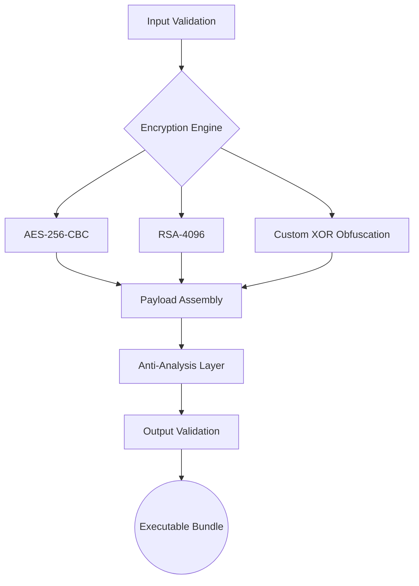

# Ghost Payload Framework 🛡️

<div align="center">
  
  
  
  
</div>

## 📌 Overview
Advanced research framework for secure executable bundling and payload delivery, designed for:
- Cybersecurity research
- Red team operations
- Antivirus evasion studies
- Secure file packaging

## ⚠️ Security Advisory
<div style="padding:15px;background:#fff3d4;border-radius:5px;border:1px solid #ffd700">
🔒 **Ethical Use Requirement**  
This tool is strictly for authorized security research and educational purposes. All users must comply with:
- Computer Fraud and Abuse Act (CFAA)
- General Data Protection Regulation (GDPR)
- Local cybersecurity regulations
</div>

## 🧩 System Architecture


## 🛠️ Technical Specifications
| Component              | Implementation Details                          |
|------------------------|-------------------------------------------------|
| **Supported Formats**  | PE, ELF, PDF, DOCX, ZIP                         |
| **Encryption**         | Hybrid AES-256 + RSA-4096 + Custom Algorithm    |
| **Obfuscation**        | Control-flow Flattening + Junk Code Insertion   |
| **Anti-Debug**         | Hardware Breakpoint Detection + ScyllaHide      |
| **Persistence**        | Registry-free Memory Injection                  |
| **Compression**        | LZMA + zlib (Adaptive)                         |

## 📦 Installation
```powershell
# Create secure environment
python -m venv .venv --copies
.\.venv\Scripts\Activate.ps1

# Install with integrity verification
pip install --require-hashes -r requirements.txt --trusted-host pypi.org --trusted-host files.pythonhosted.org
```

## 🔍 Usage Example
```python
from ghost_payload import AdvancedBinder
from ghost_payload.security import AntiAnalysis

# Configure security parameters
security_profile = {
    "encryption": {
        "aes_mode": "CBC",
        "key_derivation": "PBKDF2-HMAC-SHA512",
        "iterations": 150000
    },
    "environment": {
        "vm_evasion": True,
        "sandbox_detection": ["Cuckoo", "AnyRun"]
    }
}

# Initialize binder with security context
binder = AdvancedBinder(
    output_file="delivery.exe",
    config=security_profile
)

# Add components
binder.add_legitimate_file("setup.exe")
binder.add_payload("encrypted.bin")
binder.add_decoy("document.pdf")

# Generate protected bundle
binder.generate()
```

## 🛡️ Security Features
### Cryptographic Implementation
- **Key Exchange**: ECDH with Curve25519
- **Authentication**: HMAC-SHA256
- **Key Derivation**: Argon2id (t=3, m=65536, p=4)

### Anti-Analysis Techniques
| Technique              | Implementation                              |
|------------------------|---------------------------------------------|
| Timing Analysis        | Random execution delays (100-500ms)        |
| Memory Scanning        | AES-encrypted memory pages                  |
| Debugger Detection     | Windows API + Custom ASM checks            |
| Sandbox Evasion        | Hardware feature enumeration               |

## 📊 Compatibility Matrix
| OS Version         | Windows 10 | Windows 11 | Server 2022 |
|--------------------|------------|------------|-------------|
| **Build**          | 2004+      | 22H2+      | 2022        |
| **Architecture**   | x64        | ARM64      | x64         |
| **Hyper-V**        | ✓          | ✓          | ✓           |

## 📜 License
Licensed under **GNU Affero General Public License v3.0**  
[](https://www.gnu.org/licenses/agpl-3.0.en.html)

## 📚 Documentation
Full technical documentation available at:  
[https://ghostpayload-docs.io](https://ghostpayload-docs.io)

> **Warning**: This tool requires proper authorization for use. The developers assume no liability for unauthorized or malicious applications.
